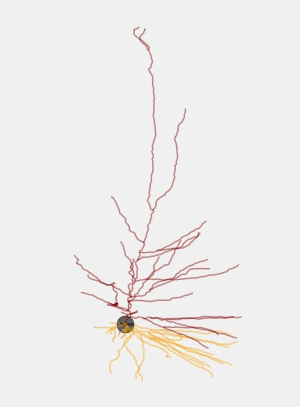

# All-active-Workflow
Creating the code base for All-active Model generation written on top of Bluepyopt

[comment]:## Visualizations

[comment]:   

[comment]:   

[comment]:### Comparison between the Experiment and Model trace

[comment]:

[comment]:    
[comment]:

[comment]:### Overlay of soma and AIS voltage (AP initiates at AIS)

[comment]:

[comment]:    
[comment]:

[comment]:### Evolution of the population during GA

[comment]:

[comment]:    
[comment]:

