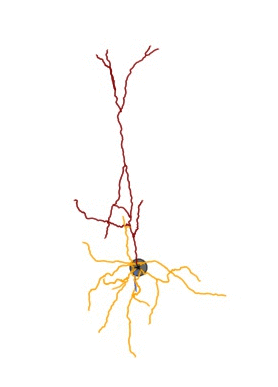
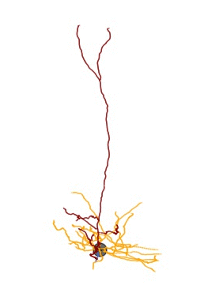
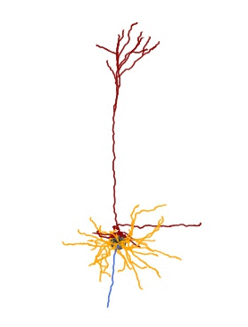
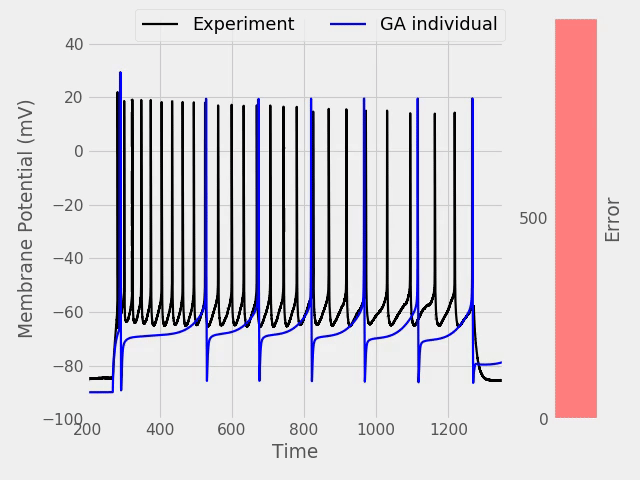

# All-active-Workflow
Creating the code base for All-active Model generation written on top of Bluepyopt

## Visualizations

   

### Comparison between the Experiment and Model trace

    

### Overlay of soma and AIS voltage (AP initiates at AIS)

    

### Evolution of the population during GA

    

